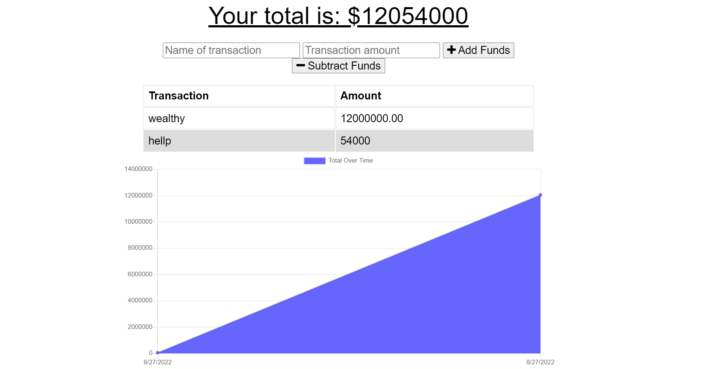

# Budget Tracker 
This is a site to track your budget and save your informations.

## User Story.
AS AN avid traveler I WANT to be able to track my withdrawals and deposits with or without a data/internet connection SO THAT my account balance is accurate when I am traveling

## Skills used in development.
* App is built on MongoDb Data Base with Mongoose ODM.
* Express and Mongoose packages.
* Using MongoDb Atlas to work with db's.
* VS Code used as source code editor.
* Created service workers to manage app in offline/online modes.

## Heroku deployed

https://pwa-budget-tracking-app.herokuapp.com/

## Demo

## Contribution

Nardos Abraham